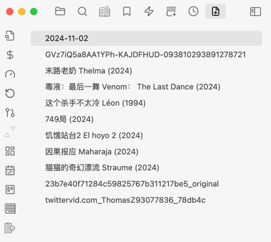

# Recently Added Files

This plugin displays a list of most last added files in the sidebar. Optionally include paths of files which should be excluded from the list.

As with the file explorer view:
- New files
- New images
- New PDF
- ......

## Screenshots

# Function

This plugin can quickly display recently added files, making it easier to process these documents.
For example: After adding pictures, quickly find and rename them

