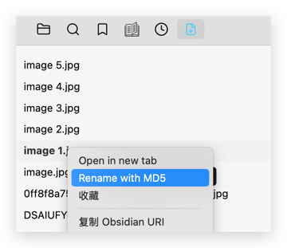
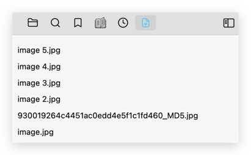
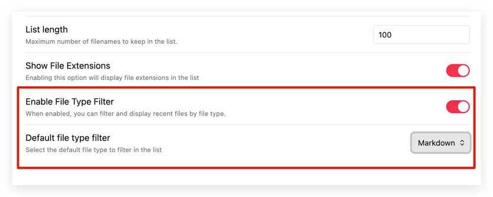
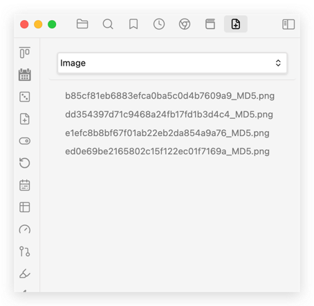

# 最近添加的文件列表

[English](./README.md) | 中文

此插件会在侧边栏显示最近添加文件的列表。您可以选择性地排除某些文件路径，使其不显示在列表中。

与文件资源管理器视图类似：

- 最新添加的md文件
- 最新添加的图片
- 最新添加PDF文档
- ......

## 截图

# 功能 

此插件可以快速显示最近添加的文件，方便处理这些文档。
例如：添加图片后，可以快速找到并重命名它们。

## 1、新增文件重命名

编辑文档的过程中添加多张图片,名称相同会导致名称重复,添加了MD5重命名的功能,快速变更新增图片的名称.

修改前

修改后

## 2、文件分类筛选

项目引入了**文件分类筛选**功能，用户可以根据文件类型筛选并显示新增的文件。支持的筛选类别包括：

- **所有文件**：显示所有文件，不区分类型。
- **Markdown**：筛选并显示 `.md` 和 `.markdown` 文件。
- **PDF**：筛选并显示 `.pdf` 文件。
- **图片**：筛选并显示图片文件，如 `.png`、`.jpg`、`.jpeg`、`.gif`、`.bmp`、`.svg` 和 `.webp`。
- **视频**：筛选并显示视频文件，包括 `.mp4`、`.webm`、`.mov`、`.avi`、`.mkv` 和 `.m4v`。
- **其他**：显示所有不属于上述类别的文件。

该功能帮助用户快速根据文件类型导航和管理文件，提高文件处理的效率。

插件配置，默认不开启文件筛选，可以根据需求进行开启。

# 🙏 致谢

本项目的核心功能主要依赖于 [recent-files-obsidian](https://github.com/tgrosinger/recent-files-obsidian) 项目所做的出色工作，我对其贡献深表感谢。

在使用 Obsidian 编辑文档时，我经常添加大量文档和图片，导致难以定位新添加的文件进行编辑。我发现 recent-files-obsidian 插件的功能可以显示最近打开或编辑的文件，但这并未完全满足我的需求。因此，我重新设计了该功能，以支持仅显示新添加的文件。
