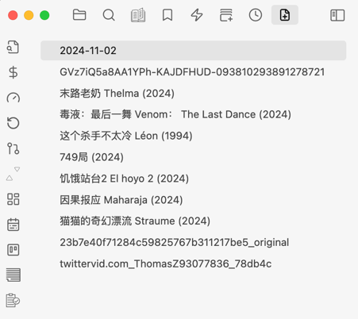
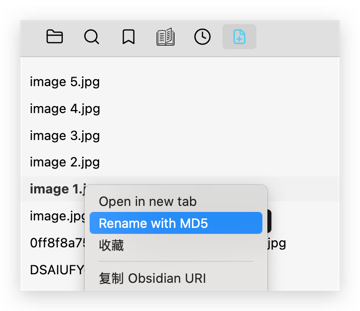
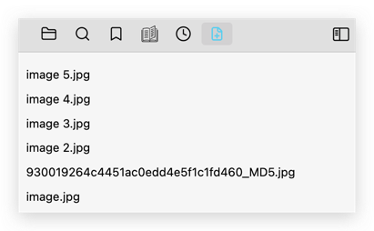

# 最近添加的文件

[English](./README.md) | 中文

一个 [Obsidian](https://obsidian.md) 插件，在侧边栏实时显示最近**新增**或**修改**的文件列表——而不仅仅是最近打开的文件。

当你批量导入图片、拖入参考 PDF，或者一次性创建多篇笔记后，可以立刻在侧边栏找到这些文件并进行处理。

---

## 功能列表

| 功能 | 说明 |
|------|------|
| **新增 / 修改模式** | 按文件**创建时间**或**最近修改时间**追踪 |
| **文件类型筛选** | 只显示 Markdown、PDF、图片、视频、Canvas 或其他文件 |
| **搜索** | 顶部搜索框，实时按文件名过滤列表 |
| **排序方式** | 最新优先 · 最旧优先 · A→Z · Z→A |
| **Pin 置顶** | 右键任意文件 → 置顶，置顶文件始终排在列表最前 |
| **哈希重命名** | 右键 → 用 SHA-256 哈希重命名，快速解决文件名冲突 |
| **悬停预览** | 将鼠标悬停在图片或 PDF 条目上，弹出浮动预览 |
| **排除路径 / 标签** | 通过正则表达式或 frontmatter 标签过滤不需要的文件 |
| **显示 / 隐藏扩展名** | 在列表中切换是否显示文件扩展名 |

---

## 使用方法

### 侧边栏视图

打开命令面板，执行 **"Recently Added Files: Open"**，或点击左侧工具栏的文件图标。  
视图出现在左侧边栏，在你新增或修改文件时自动更新。

### Pin 置顶

右键文件条目 → **置顶**。置顶的文件会移动到列表顶部，以加粗 + 图钉图标显示。再次右键 → **取消置顶**可解除。

### 搜索

在视图顶部的搜索框中输入关键词，列表实时按文件名过滤。

### 文件类型筛选

在插件设置中启用**文件类型筛选**，视图顶部会出现下拉菜单，可在"全部、Markdown、PDF、图片、视频、画布、其他"之间切换。

### 哈希重命名

导入同名图片后，在侧边栏右键文件 → **用哈希重命名**。文件将被重命名为 `<sha256>_HASH.<ext>` 格式的唯一文件名，立即解决命名冲突。

修改前：

修改后：

### 悬停预览

将鼠标悬停在图片或 PDF 条目上，无需打开文件即可看到浮动缩略图预览。

---

## 设置项

| 设置 | 默认值 | 说明 |
|------|--------|------|
| 列表追踪模式 | 新建文件 | 追踪**新建**文件，或切换为追踪**最近修改**文件 |
| 列表长度 | 100 | 最多保留的文件条目数 |
| 显示文件扩展名 | 关 | 在列表中显示或隐藏文件扩展名 |
| 启用文件类型筛选 | 关 | 在侧边栏显示类型筛选下拉菜单 |
| 默认文件类型筛选 | 全部文件 | 视图打开时默认选中的类型 |
| 文件排序方式 | 最新优先 | 列表条目的排序规则 |
| 排除路径模式 | — | 正则表达式，每行一个，匹配的文件将被排除 |
| 排除前置标签 | — | frontmatter 标签，每行一个，含该标签的文件将被排除 |

### 模块开关

设置页允许独立启用或禁用各功能模块：

- **最近文件核心** — 文件追踪、侧边栏列表、命令
- **筛选与排序** — 类型筛选、排序模式、文件类型图标
- **悬停预览** — 悬停时显示图片 / PDF 预览
- **重命名动作** — 右键哈希重命名

---

## 命令

| 命令 | 说明 |
|------|------|
| Open recently added files | 打开 / 显示侧边栏视图 |
| Clear recently added files list | 清空列表 |
| Prune missing entries | 移除 vault 中已不存在的条目 |
| Open top 5 recently added files | 在新标签页中打开最近 5 个文件 |

---

## 🙏 致谢

项目的原始思路和核心架构大量参考了 tgrosinger 的 [recent-files-obsidian](https://github.com/tgrosinger/recent-files-obsidian)，对其出色的基础工作深表感谢。

本插件是为了填补一个具体的空缺：`recent-files-obsidian` 追踪的是最近*打开或编辑*的文件，而本插件专注于最近*新增*的文件——那些你刚刚从外部导入、下载或由其他工具创建的文件——让你在它们落入 vault 之后可以立即找到并处理。
